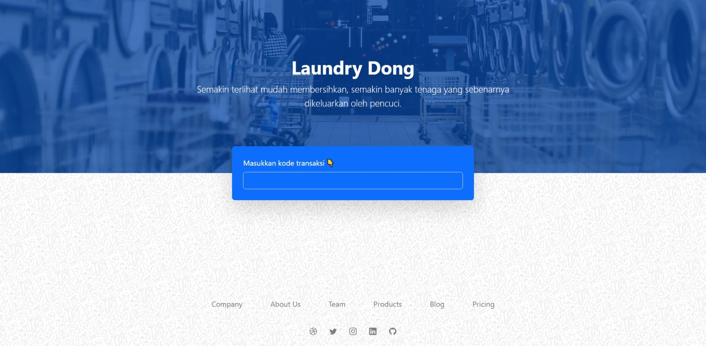

<a name="readme-top"></a>

<!-- ABOUT THE PROJECT -->

# IEIS (Image Emotion Identification System)



Laundry Dong is a web-based application that helps users manage their laundry business effectively. Users can input laundry orders, manage inventory, and track financial transactions. This system is designed to streamline the laundry management process, increasing efficiency and productivity.

Use the `README.md` to get started.

<p align="right">(<a href="#readme-top">back to top</a>)</p>

## Built With

- 
- 
- 
- 

<p align="right">(<a href="#readme-top">back to top</a>)</p>

<!-- GETTING STARTED -->

## Installation

1. Clone the repo
   ```sh
   https://github.com/agungmahadana/Laundry-Dong.git
   ```
2. Import the database schema from the database.sql file
3. Start a local server and navigate to the website

<p align="right">(<a href="#readme-top">back to top</a>)</p>

<!-- CONTRIBUTING -->

## Contributing

Contributions are what make the open source community such an amazing place to learn, inspire, and create. Any contributions you make are **greatly appreciated**.

If you have a suggestion that would make this better, please fork the repo and create a pull request. You can also simply open an issue with the tag "enhancement".
Don't forget to give the project a star! Thanks again!

1. Fork the Project
2. Create your Feature Branch (`git checkout -b feature/AmazingFeature`)
3. Commit your Changes (`git commit -m 'Add some AmazingFeature'`)
4. Push to the Branch (`git push origin feature/AmazingFeature`)
5. Open a Pull Request

<p align="right">(<a href="#readme-top">back to top</a>)</p>

<!-- ACKNOWLEDGMENTS -->

## Acknowledgments

- [PHP](https://www.php.net/)
- [HTML](#)
- [Bootstrap](https://getbootstrap.com/)
- [MySQL](https://mysql.com/)

<p align="right">(<a href="#readme-top">back to top</a>)</p>